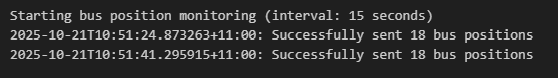
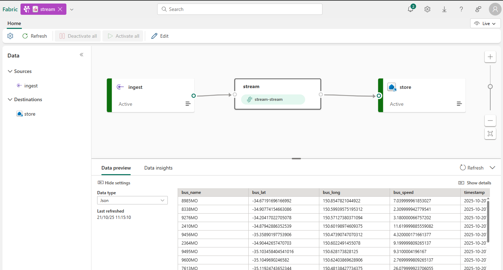
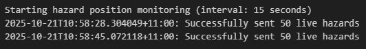
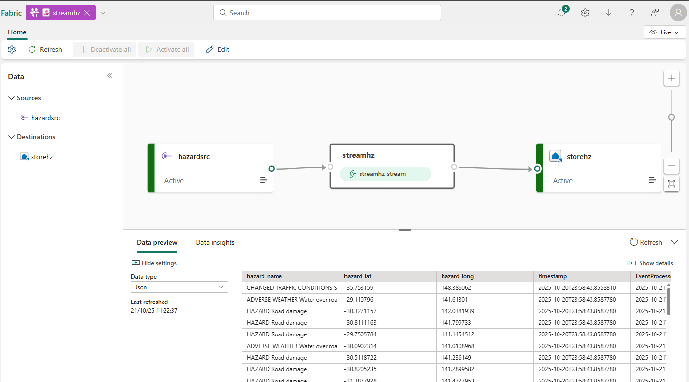

# API Integration

This guide walks you through setting up real-time data ingestion from Transport NSW APIs using the provided Spark notebooks and configuring Microsoft Fabric Eventstreams to receive the data.

## 📋 Prerequisites

Before beginning, ensure you have:

- **Completed Environment Setup** with task flow created
- **Transport RTI Analysis workspace** accessible
- **Downloaded notebook files** from the repository's `assets` folder

## 🔑 Step 1: Obtain Transport NSW API Access

### 1.1 Register for API Access

1. Navigate to [Transport NSW Open Data Hub](https://opendata.transport.nsw.gov.au/)
2. Click **"Developers"** in the main navigation
3. Select **"User Guide"** for step-by-step registration instructions
4. **Create developer account** using the registration process
5. **Generate API key** following the user guide steps

### 1.2 Locate Required APIs

You'll need access to these specific Transport NSW APIs:
- **Regional Buses Vehicle Positions**: `/v1/gtfs/vehiclepos/regionbuses/sydneysurrounds`
- **Live Hazards**: `/v1/live/hazards/incident/open`

### 1.3 Note API Details

After registration, record:
- **API Key**: Your unique access credential

## 🌊 Step 2: Create Eventstreams with Custom Endpoints

### 2.1 Create Bus Location Eventstream

1. In your **Transport RTI Analysis** workspace, click **"+ New"**
2. Select **"Eventstream"**
3. Configure the eventstream:
   - **Name**: `Stream_Bus_Loc`
   - **Description**: `Real-time bus position data processing`
4. Click **"Create"**

### 2.2 Configure Custom Endpoint for Bus Data

Follow the official Microsoft documentation for creating custom endpoints in Eventstreams:

📖 **Reference**: [Add a custom app source to an eventstream - Microsoft Fabric](https://learn.microsoft.com/en-us/fabric/real-time-intelligence/event-streams/add-source-custom-app?pivots=basic-features)

1. In the Eventstream designer, click **"Add source"**
2. Select **"Custom endpoint"** 
3. Configure the endpoint:
   - **Source name**: `ingest`
4. Click **"Add"** and then proceed to publish
5. Copy the **Event Hub connection string under SAS Key Authentication** - you'll need this for the bus position notebook

### 2.3 Create Hazard Information Eventstream

1. Return to workspace, click **"+ New"** → **"Eventstream"**
2. Configure the second eventstream:
   - **Name**: `Stream_Live_Info`
   - **Description**: `Real-time hazard and incident data processing`
3. **Follow the same custom endpoint process** as Step 2.2:
   - Custom endpoint source name: `ingest`
4. **Copy the Event Hub connection string** for the hazard data notebook

## 📓 Step 3: Setup Bus Position Data Notebook

### 3.1 Upload the Bus Position Notebook

1. In your workspace, click **"Import"** → **"Notebook"** → **"From this computer"**
2. Navigate to the repository's `assets/buses/` folder
3. Upload **`ingest.ipynb`**
4. Once uploaded, rename it to **`Call Buses API`** to match your task flow

### 3.2 Configure API Credentials in the Notebook

1. **Open the uploaded notebook**
2. **Locate the credentials section** (typically in the second or third cell)
3. **Update the following variables**:
   - `myapikey`: Your Transport NSW API key from Step 1
   - `myconnectionstring`: The Event Hub connection string from Step 2.2

> **Security Note**: In production environments, use Fabric's secret management or Azure Key Vault for credential storage.

## ✅ Step 4: Verify Bus Data Integration

### 4.1 Run the Bus Position Notebook

1. **Execute all cells** in the `Call Buses API` notebook
2. **Monitor the terminal output** - you should see messages confirming successful data transmission:

**Expected Output:**

### 4.2 Check Eventstream Activity

1. Navigate to your **Stream_Bus_Loc** eventstream
2. Verify the **ingest** source shows **"Active"** status
3. Confirm data is flowing through the eventstream

**Expected Output:**

## 📓 Step 5: Setup Hazard Data Notebook

### 5.1 Upload the Hazard Data Notebook

1. In your workspace, click **"Import"** → **"Notebook"** → **"From this computer"**
2. Navigate to the repository's `assets/hazards/` folder
3. Upload **`ingesthz.ipynb`**
4. Once uploaded, rename it to **`Call Hazards API`** to match your task flow

### 5.2 Configure Hazard API Credentials

1. **Open the uploaded notebook**
2. **Locate the credentials section**
3. **Update the variables**:
   - `myapikey`: Your Transport NSW API key (same as Step 3.2)
   - `myconnectionstring`: The Event Hub connection string from Step 2.3 (hazard eventstream)

## ✅ Step 6: Verify Hazard Data Integration

### 6.1 Run the Hazard Notebook

1. **Execute all cells** in the `Call Hazards API` notebook
2. **Monitor terminal output** - you should see messages confirming successful hazard data processing:

**Expected Output:**

### 6.2 Check Hazard Eventstream

1. Navigate to **Stream_Live_Info** eventstream  
2. **Verify active status** for the ingest source
3. **Confirm data flow** through the eventstream

**Expected Output:**

## ✅ Step 7: Confirm End-to-End Pipeline

### 7.1 Validate Complete Integration

Ensure both data streams are operational:

- [ ] **Call Buses API** notebook running and sending bus position data
- [ ] **Call Hazards API** notebook running and processing incident data  
- [ ] **Stream_Bus_Loc** eventstream showing active status with data flow
- [ ] **Stream_Live_Info** eventstream processing hazard information

### 7.2 Monitor Continuous Operation

Both notebooks should display regular terminal output:
- **Bus positions**: Bus positions sent every 15 seconds
- **Live hazards**: Hazard records sent every 15 seconds

### 7.3 Troubleshooting Common Issues

**Authentication errors:**
- Confirm Transport NSW API key is valid and active

**Connection failures:**
- Verify Eventstream custom endpoints are properly configured following Microsoft documentation

---

## Related Documentation

- [Microsoft Fabric Eventstreams](https://learn.microsoft.com/en-us/fabric/real-time-intelligence/event-streams/overview)
- [Create and Manage Eventstreams](https://learn.microsoft.com/en-us/fabric/real-time-intelligence/event-streams/create-manage-an-eventstream)
- [Custom Endpoints in Eventstreams](https://learn.microsoft.com/en-us/fabric/real-time-intelligence/event-streams/add-source-custom-app)

---

## 🚀 Next Steps

Your API integration is now complete! Both Transport NSW APIs are successfully streaming real-time data into your Fabric Eventstreams. The next step is to configure data storage in Eventhouse and begin building analytics capabilities.

---

## Tutorial Navigation

**← Previous:** [Tutorial 1: Environment Setup](./01-environment-setup.md)  
**→ Next:** [Tutorial 3: Data Storage Configuration](./03-data-storage.md)