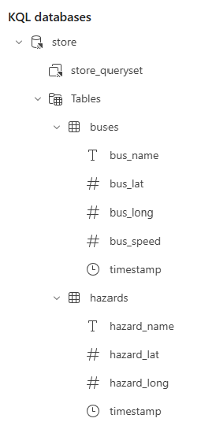

# Tutorial 3: Data Storage Configuration

This tutorial guides you through setting up an Eventhouse to store the real-time transport data from your Eventstreams.

## Prerequisites

- Completed [Tutorial 1: Environment Setup](./01-environment-setup.md)
- Completed [Tutorial 2: API Integration](./02-api-integration.md)
- Both Eventstreams (buses and hazards) running and receiving data

## Overview

You'll configure data storage by:
1. Creating an Eventhouse with a KQL database
2. Adding Eventhouse destinations to your Eventstreams
3. Setting up data tables for bus positions and hazards
4. Validating the complete data pipeline

---

## Section 1: Create Eventhouse

An Eventhouse provides a centralised location to store and analyse your real-time transport data using KQL (Kusto Query Language).

### Step 1: Create the Eventhouse

1. Navigate to your Fabric workspace
2. Select **New** → **Eventhouse**
3. Enter the name: `TransportAnalysis`
4. Select **Create**

The system automatically creates:
- The `TransportAnalysis` Eventhouse
- A default KQL database with the same name

### Step 2: Verify Eventhouse Creation

1. Confirm you can see the Eventhouse in your workspace
2. Open the Eventhouse to view the system overview
3. Note the default KQL database `TransportAnalysis` in the explorer panel

---

## Section 2: Configure Eventstream Destinations

Now you'll connect your Eventstreams to the Eventhouse to store the incoming transport data.

### Step 1: Add Destination to Buses Eventstream

1. Open your `Stream_Bus_Loc` Eventstream
2. Select **Edit** to enter edit mode
3. In the canvas, select **Add destination**
4. Choose **Eventhouse** from the destination options

5. Configure the Eventhouse destination:
   - **Destination name**: `BusPositions-Storage`
   - **Workspace**: Select your current workspace
   - **Eventhouse**: `TransportAnalysis`
   - **Database**: `TransportAnalysis` (default)
   - **Ingestion mode**: **Direct ingestion**

6. Select **Add** to create the destination and connect the components

7. **Publish** the Eventstream to apply changes

### Step 2: Add Destination to Hazards Eventstream

1. Open your `Stream_Live_Info` Eventstream
2. Select **Edit** to enter edit mode
3. Add an **Eventhouse** destination with these settings:
   - **Destination name**: `HazardData-Storage`
   - **Workspace**: Select your current workspace
   - **Eventhouse**: `TransportAnalysis`
   - **Database**: `TransportAnalysis` (default)
   - **Ingestion mode**: **Direct ingestion**

4. Select **Add** and **Publish** the changes

---

## Section 3: Configure Data Tables

The Eventhouse destinations will automatically create tables when data starts flowing. You'll configure the table schemas to properly store the transport data.

### Step 1: Configure Bus Positions Table

1. Return to your `Stream_Bus_Loc` Eventstream
2. Select the **BusPositions-Storage** destination node
3. In the destination configuration panel, select **Open item** to configure the table
4. The **Get data** wizard opens automatically
5. Configure the data source:
   - **Table**: Select **+ New table**
   - **Table name**: `buses`
   - **Data connection name**: Accept the default

6. Select **Next** to proceed to the schema configuration

### Step 2: Configure Data Schema for Bus Positions

1. In the **Inspect** tab, review the data preview
2. The system automatically detects the JSON schema
3. Verify key columns are properly mapped:
   - `bus_name` (string)
   - `bus_lat` (real)  
   - `bus_long` (real)
   - `bus_speed` (real)
   - `timestamp` (datetime)

4. Select **Finish** to create the table

### Step 3: Configure Hazards Table

1. Open your `Stream_Live_Info` Eventstream
2. Select the **HazardData-Storage** destination node
3. Select **Open item** to configure the hazard data table
4. Configure the table:
   - **Table name**: `hazards`
   - **Data connection name**: Accept the default

5. In the schema configuration, verify columns for:
   - `hazard_name` (string)
   - `hazard_lat` (real)
   - `hazard_long` (real)
   - `timestamp` (datetime)

6. Select **Finish** to complete the table creation

---

## Section 4: Validate Data Pipeline

Verify that your complete data pipeline is working from Transport NSW APIs through to data storage.

### Step 1: Check Data Ingestion

1. Open your `TransportAnalysis` Eventhouse
2. Navigate to the **TransportAnalysis** KQL database
3. You should see both tables with their expected structure:
   - `buses`
   - `hazards`



The expected structure shows:
- **buses** table with columns: `bus_name`, `bus_lat`, `bus_long`, `bus_speed`, `timestamp`
- **hazards** table with columns: `hazard_name`, `hazard_lat`, `hazard_long`, `timestamp`

### Step 2: Query Live Data

1. In the KQL database, select **New** → **KQL Queryset**
2. Name it `Transport Data Queries`
3. Run these validation queries:

**Check recent bus positions:**
```kql
buses
| where ingestion_time() > ago(10m)
| take 10
```

**Check hazard data:**
```kql
hazards  
| where ingestion_time() > ago(10m)
| take 10
```

---

## Verification Checklist

Confirm the following are working:

- [ ] Eventhouse `TransportAnalysis` created successfully
- [ ] Both Eventstreams have Eventhouse destinations configured
- [ ] `buses` table receiving real-time bus location data with columns: `bus_name`, `bus_lat`, `bus_long`, `bus_speed`, `timestamp`
- [ ] `hazards` table receiving live hazard information with columns: `hazard_name`, `hazard_lat`, `hazard_long`, `timestamp`
- [ ] KQL queries return recent data from both tables

## Troubleshooting

**No data appearing in tables:**
- Verify API notebooks are running successfully
- Confirm Eventhouse destinations are published

---

## Related Documentation

- [Microsoft Fabric Eventhouse Documentation](https://learn.microsoft.com/en-us/fabric/real-time-intelligence/eventhouse)
- [KQL Database Management](https://learn.microsoft.com/en-us/fabric/real-time-intelligence/create-database)
- [Eventstream Destinations](https://learn.microsoft.com/en-us/fabric/real-time-intelligence/event-streams/add-manage-eventstream-destinations)

---

## Next Steps

With your data storage configured, you now have:
- Real-time transport data flowing into structured tables (`buses` and `hazards`)
- A foundation for geospatial and temporal analytics
- The ability to query historical and live transport patterns with KQL

In the next tutorial, you'll implement **Hazard Proximity Analysis** to detect when buses are approaching dangerous areas in real-time.

---

## Tutorial Navigation

**← Previous:** [Tutorial 2: API Integration](./02-api-integration.md)  
**→ Next:** [Tutorial 4: Hazard Proximity Analysis](./04-hazard-proximity-analysis.md)