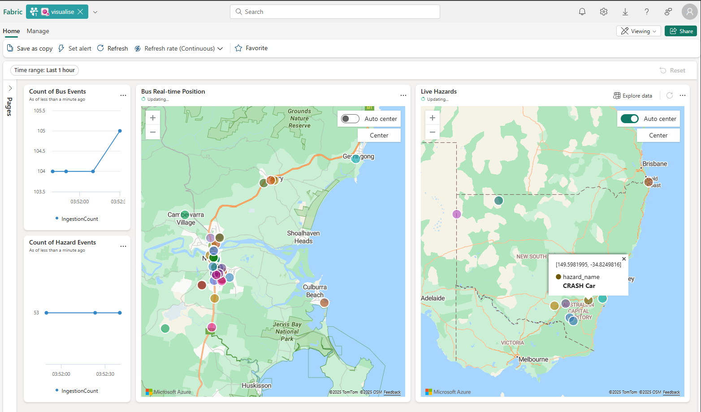
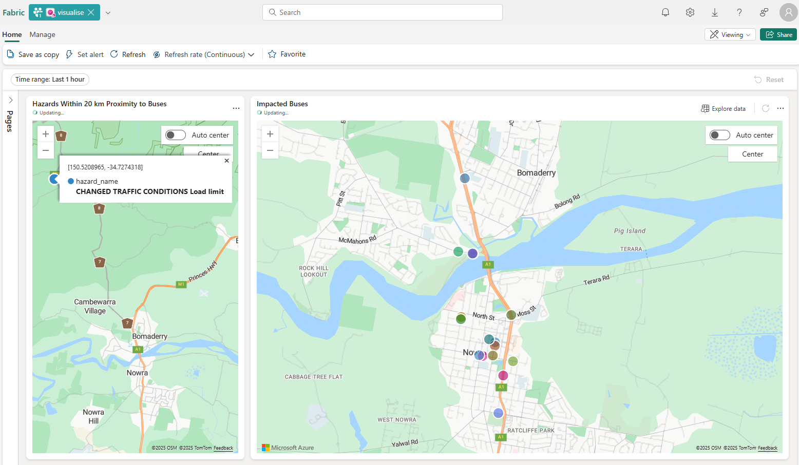
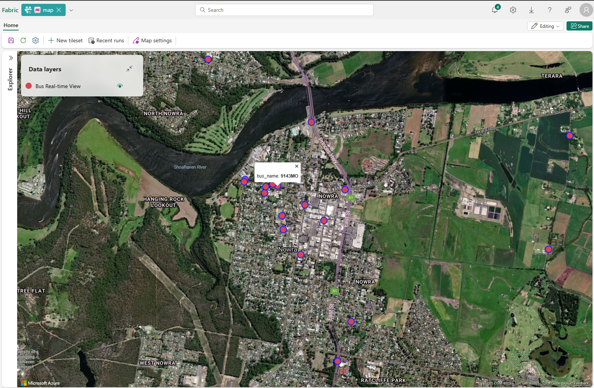

# Tutorial 4: Hazard Proximity Analysis

This tutorial guides you through creating Real-Time Intelligence (RTI) dashboards to visualise live transport data and implement proximity analysis between buses and hazards.

## Prerequisites

- Completed [Tutorial 1: Environment Setup](./01-environment-setup.md)
- Completed [Tutorial 2: API Integration](./02-api-integration.md)
- Completed [Tutorial 3: Data Storage Configuration](./03-data-storage.md)
- Active data flow in both `buses` and `hazards` tables

## Overview

You'll create two RTI dashboards:

**Part 1: Real-Time Transport Visualisation**
- Live bus positions and hazard locations
- Real-time event counts

**Part 2: Proximity Analysis Dashboard**  
- Hazards within 20km of buses
- Impacted buses identification

---

## Part 1: Real-Time Transport Visualisation Dashboard

This dashboard provides a comprehensive real-time view of transport operations:



### Step 1: Create RTI Dashboard

1. Navigate to your Fabric workspace
2. Select **New** → **Real-Time Dashboard**
3. Name: `Transport Real-Time Monitor`
4. Select **Create**

### Step 2: Add Data Source

1. Select **Manage** → **Data sources** → **Add data source**
2. Choose your `TransportAnalysis` KQL database
3. Select **Add**

### Step 3: Create Bus Event Count Visual

1. Select **Add tile** → **KQL Queryset**
2. **Tile name**: `Count of Bus Events`
3. **Visual type**: Line chart
4. **KQL Query**:

```kql
buses
| where timestamp > ago(20m)
| summarize IngestionCount = count() by bin(ingestion_time(), 10sec)
| render columnchart
```

### Step 4: Create Hazard Event Count Visual

1. Add **KQL Queryset** tile
2. **Tile name**: `Count of Hazard Events`
3. **Visual type**: Line chart  
4. **KQL Query**:

```kql
hazards
| where timestamp > ago(20m)
| summarize IngestionCount = count() by bin(ingestion_time(), 10sec)
| render columnchart
```

### Step 5: Create Bus Real-Time Position Map

1. Add **KQL Queryset** tile
2. **Tile name**: `Bus Real-time Position`
3. **Visual type**: Map (*Define location by latitude & longitude*)
4. **KQL Query**:

```kql
buses
| where timestamp > ago(2m)
| summarize max_timestamp = max(timestamp) by bus_name
| join kind=inner (
    buses
    | project bus_name, bus_lat, bus_long, bus_speed, timestamp
) on bus_name
| where timestamp == max_timestamp
| project bus_name, bus_lat, bus_long,timestamp, bus_speed
```

### Step 6: Create Live Hazards Map

1. Add **KQL Queryset** tile
2. **Tile name**: `Live Hazards`
3. **Visual type**: Map (*Define location by latitude & longitude*)
4. **KQL Query**:

```kql
hazards
| where timestamp > ago(2m)
| summarize max_timestamp = max(timestamp) by hazard_name
| join kind=inner (
    hazards
    | project hazard_name, hazard_lat, hazard_long, timestamp
) on hazard_name
| where timestamp == max_timestamp
| project hazard_name, hazard_lat, hazard_long,timestamp
```

---

## Part 2: Proximity Analysis Dashboard

This dashboard focuses on identifying hazards within proximity of buses:



### Step 1: Create Proximity Dashboard

1. Select **New** → **Real-Time Dashboard**
2. Name: `Hazard Proximity Analysis`
3. Add `TransportAnalysis` data source

### Step 2: Create Hazards Within Proximity Map

1. Add **KQL Queryset** tile
2. **Tile name**: `Hazards Within 20 km Proximity to Buses`
3. **Visual type**: Map (*Define location by latitude & longitude*)
4. **KQL Query**:

```kql
let latest_buses = buses
| where timestamp > ago(2m)
| summarize max_timestamp = max(timestamp) by bus_name
| join kind=inner (
    buses
    | project bus_name, bus_lat, bus_long, bus_speed, timestamp
) on bus_name
| where timestamp == max_timestamp
| project bus_name, bus_lat, bus_long,timestamp, bus_speed;

let latest_hazards = hazards
| where timestamp > ago(2m)
| summarize max_timestamp = max(timestamp) by hazard_name
| join kind=inner (
    hazards
    | project hazard_name, hazard_lat, hazard_long, timestamp
) on hazard_name
| where timestamp == max_timestamp
| project hazard_name, hazard_lat, hazard_long,timestamp;

latest_buses
| extend key=1
| join kind=inner (latest_hazards | extend key=1) on key
| where geo_distance_2points(bus_long, bus_lat, hazard_long, hazard_lat) <= 20000
| project hazard_name, hazard_lat, hazard_long
```

### Step 3: Create Impacted Buses Map

1. Add **KQL Queryset** tile
2. **Tile name**: `Impacted Buses`
3. **Visual type**: Map (*Define location by latitude & longitude*)
4. **KQL Query**:

```kql
let latest_buses = buses
| where timestamp > ago(2m)
| summarize max_timestamp = max(timestamp) by bus_name
| join kind=inner (
    buses
    | project bus_name, bus_lat, bus_long, bus_speed, timestamp
) on bus_name
| where timestamp == max_timestamp
| project bus_name, bus_lat, bus_long,timestamp, bus_speed;

let latest_hazards = hazards
| where timestamp > ago(2m)
| summarize max_timestamp = max(timestamp) by hazard_name
| join kind=inner (
    hazards
    | project hazard_name, hazard_lat, hazard_long, timestamp
) on hazard_name
| where timestamp == max_timestamp
| project hazard_name, hazard_lat, hazard_long,timestamp;

latest_buses
| extend key=1
| join kind=inner (latest_hazards | extend key=1) on key
| where geo_distance_2points(bus_long, bus_lat, hazard_long, hazard_lat) <= 20000
| project bus_name, hazard_name, bus_lat, bus_long
```

---

## Verification

Confirm both dashboards display:

- [ ] Bus and hazard event counts updating in real-time
- [ ] Current bus positions on map
- [ ] Active hazards displayed geographically  
- [ ] Proximity analysis showing hazards within 20km of buses
- [ ] Impacted buses highlighted on separate map

Your completed dashboards should match the expected outputs shown above, providing real-time transport monitoring and proximity-based risk analysis capabilities.

---

## Enhanced Maps Visualisation

At the time of writing this tutorial, Fabric RTI includes advanced mapping capabilities that are in preview. These enhanced maps provide rich, interactive geographical visualisations with features beyond standard plotting, including custom styling, layers, and advanced interactive elements:



While this tutorial focuses on standard map visuals, you can explore Fabric RTI's enhanced mapping capabilities for more sophisticated geospatial analysis and presentation options.

---

## Related Documentation

- [Microsoft Fabric Real-Time Dashboards](https://learn.microsoft.com/en-us/fabric/real-time-intelligence/dashboard-real-time-create)
- [KQL Query Language Reference](https://learn.microsoft.com/en-us/kusto/query/)
- [Map Visualisations in Fabric](https://learn.microsoft.com/en-us/fabric/real-time-intelligence/dashboard-visuals-customize)
- [Create Maps in Fabric RTI](https://learn.microsoft.com/en-us/fabric/real-time-intelligence/map/create-map)

---

## Next Steps

With your hazard proximity analysis dashboards operational, you now have:
- Real-time visibility into transport operations and safety conditions
- Automated proximity detection between buses and hazards
- Interactive dashboards for operational monitoring and decision-making
- Foundation for automated alerting based on proximity analysis

In the next tutorial, you'll implement **Bus Route Anomaly Detection** to identify unusual vehicle behaviour patterns and potential operational issues.

---

## Tutorial Navigation

**← Previous:** [Tutorial 3: Data Storage Configuration](./03-data-storage.md)  
**→ Next:** [Tutorial 5: Bus Route Anomaly Detection](./05-bus-route-anomaly-detection.md)
