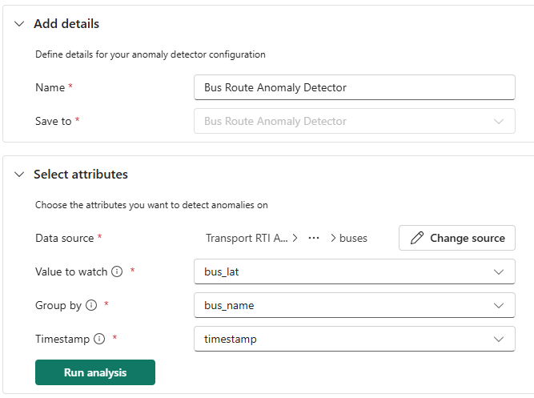
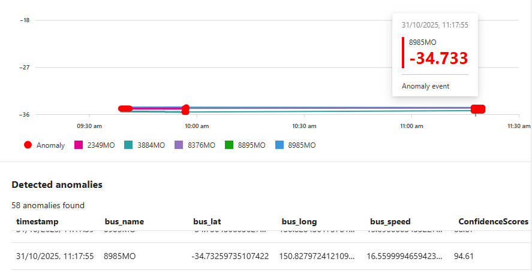

# Tutorial 5: Bus Route Anomaly Detection

This tutorial demonstrates how to use Fabric RTI's native anomaly detection capability to identify bus route deviations by monitoring latitude patterns.

## Prerequisites

- Completed [Tutorial 1: Environment Setup](./01-environment-setup.md)
- Completed [Tutorial 2: API Integration](./02-api-integration.md)
- Completed [Tutorial 3: Data Storage Configuration](./03-data-storage.md)
- Completed [Tutorial 4: Hazard Proximity Analysis](./04-hazard-proximity-analysis.md)
- Historical bus data available in your `buses` table

## Overview

Fabric RTI includes native anomaly detection capabilities (in preview at the time of writing) that automatically identify unusual patterns in your data. You'll configure anomaly detection to monitor bus latitude values and detect route deviations.

---

## Part 1: Create Anomaly Detector

### Step 1: Enable Python Plugin

1. Navigate to your `TransportAnalysis` Eventhouse
2. In the upper toolbar, select **Plugins**
3. Enable the **Python language extension**
4. Select the **Python 3.11.7 DL plugin** and select **Done**

> **Note**: Plugin activation can take some time. Once enabled, proceed to Step 2.

### Step 2: Create Detector

1. Navigate to **Real-Time hub** in the left navigation pane
2. Locate your `buses` table
3. Select the **⋯** (three dots) → **Anomaly detection**
4. For **Save to**, select **Create detector**
5. Enter detector name: `Bus Route Anomaly Detector`
6. Select **Create**

---

## Part 2: Configure Detection

### Step 3: Set Analysis Parameters

Configure the anomaly detection parameters as follows:

1. **Data source**: Verify `buses` table is selected
2. **Value to watch**: Select `bus_lat`
3. **Group by**: Select `bus_name`
4. **Timestamp**: Select `timestamp`

### Step 4: Run Analysis

1. Select **Run analysis** to begin automated model evaluation
2. Wait for analysis completion
3. System tests multiple anomaly detection algorithms automatically
4. Review the recommended models (note that Fabric RTI will analyse your specific data patterns and may recommend different models than shown in the example):
   - Example models might include: **Robust Distance Score with Advanced Seasonality**, **Average Distance Score**, or **Principal Component Anomaly Detection**
   - The system will mark the best-performing model as **Recommended** based on your bus data patterns
5. Select the recommended model provided by the system
6. Choose an appropriate sensitivity level based on the options presented

---

## Part 3: Review Results

### Step 5: Validate Detection

1. Review the anomaly detection results:
   - **Note**: Anomalies will only be detected if your bus data contains actual irregular patterns or route deviations
   - If no anomalies are found, the system will display "No anomalies to show" - this indicates normal bus operation patterns
   - When anomalies are present, you'll see the visualisation of bus latitude data with anomalies
2. Examine the time-series chart showing normal vs anomalous latitude patterns (if anomalies exist)
3. Use the time range selector to explore different periods and adjust filters if needed
4. Select **Save** to preserve your detector configuration
5. Select **Publish** to enable ongoing monitoring

---

## Verification

Confirm your anomaly detector is working:

- [ ] Python plugin enabled successfully in Eventhouse
- [ ] Anomaly detector created and configured for `bus_lat` monitoring
- [ ] Analysis completed with recommended model selected

---

## Related Documentation

- [Anomaly Detection in Real-Time Intelligence](https://learn.microsoft.com/en-us/fabric/real-time-intelligence/anomaly-detection)
- [Python Plugin in Real-Time Intelligence](https://learn.microsoft.com/en-us/fabric/real-time-intelligence/python-plugin)

---

## Next Steps

With bus route anomaly detection configured, you now have:
- Automated identification of unusual bus route patterns
- Continuous monitoring of latitude deviations
- Foundation for automated alerting based on route anomalies

In the next tutorial, you'll implement **Automated Alerting** to create real-time notifications when route anomalies are detected.

---

## Tutorial Navigation

**← Previous:** [Tutorial 4: Hazard Proximity Analysis](./04-hazard-proximity-analysis.md)  
**→ Next:** [Tutorial 6: Automated Alerting](./06-automated-alerting.md)