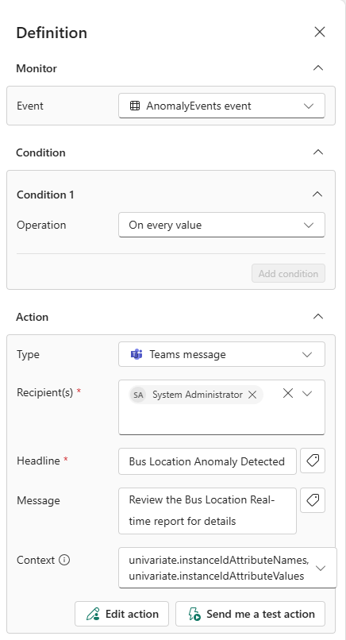
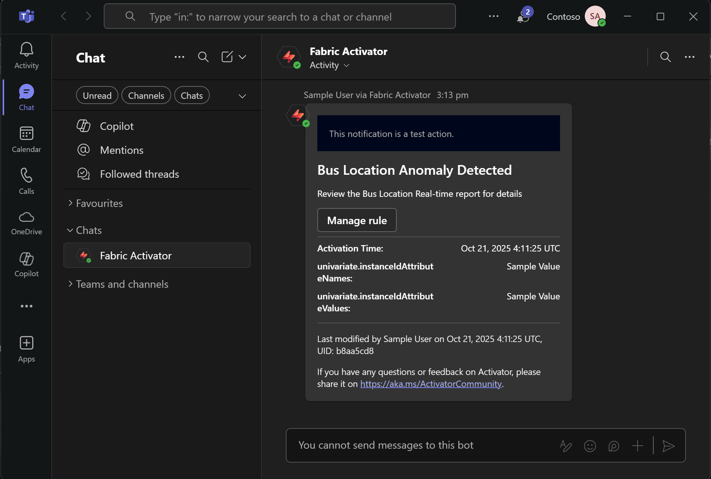

# Tutorial 6: Automated Alerting

This tutorial implements automated real-time alerting that sends Microsoft Teams notifications when bus route anomalies are detected, completing the transport monitoring solution with immediate operational alerts.

## Prerequisites

- Completed [Tutorial 1: Environment Setup](./01-environment-setup.md)
- Completed [Tutorial 2: API Integration](./02-api-integration.md)
- Completed [Tutorial 3: Data Storage Configuration](./03-data-storage.md)
- Completed [Tutorial 4: Hazard Proximity Analysis](./04-hazard-proximity-analysis.md)
- Completed [Tutorial 5: Bus Route Anomaly Detection](./05-bus-route-anomaly-detection.md)
- Microsoft Teams access for notifications

## Overview

This tutorial creates automated Teams notifications when bus route anomalies are detected, enabling immediate operational response to unusual vehicle behaviour patterns.

---

## Part 1: Create Alerting System

### Step 1: Create Activator

1. Navigate to your Fabric workspace
2. Select **New** → **Activator** (in Real-Time Intelligence section)
3. Name: `Transport Alert System`
4. Select **Create**

### Step 2: Set Up Activator

1. In the new Activator, select **Get data** → **Real-Time Hub**
2. Under **Fabric events**, choose **Anomaly detection events**
3. Proceed to set the **Anomaly Detector** created in Tutorial 5
4. **Review** the final configuration and **Save** it

---

## Part 2: Configure Alert Rules

### Step 3: Create Anomaly Alert Rule

1. Select the `Transport Alert System` Activator and choose **New rule**
2. Configure the rule parameters:
   - **Monitor** → **Event**: Anomaly events
   - **Condition**: **On every value** (trigger for each anomaly detected)

### Step 4: Configure Teams Notifications

1. In the **Action** section, select:
   - **Type**: **Teams message**
   - **Recipient(s)**: Add appropriate recipients (*such as operations team*)
2. Customize the alert message:
   - **Headline**: `Bus Location Anomaly Detected`
   - **Message**: `Review the Bus Location Real-time report for details`

---

## Part 3: Test and Activate

### Step 5: Test Alerts

1. Select **Send me a test action** to verify Teams integration
2. Check that you receive the test notification in Teams
3. Verify the message format and content are correct

### Step 6: Activate Real-time Alerting

1. Select **Start** to activate the alert rule
2. The system now monitors for bus route anomalies continuously
3. Teams notifications will be sent automatically when anomalies are detected

---

## Verification

Confirm your automated alerting is working:

- [ ] Activator created and connected to anomaly detection events
- [ ] Alert rule created for anomaly detection
- [ ] Teams notification successfully tested
- [ ] Alert rule activated for continuous monitoring

---

## Related Documentation

- [Fabric Activator Introduction](https://learn.microsoft.com/en-us/fabric/real-time-intelligence/data-activator/activator-introduction)
- [Create and Activate Fabric Activator Rules](https://learn.microsoft.com/en-us/fabric/real-time-intelligence/data-activator/activator-tutorial)

---

## Tutorial Navigation

**← Previous:** [Tutorial 5: Bus Route Anomaly Detection](./05-bus-route-anomaly-detection.md)  
**Series Complete** - You've finished the complete Real-Time Intelligence for Transport Analysis tutorial!

---

## Tutorial Series Summary

**Congratulations!** You've successfully built a complete real-time transport intelligence solution:

1. **Environment Setup** - Established Microsoft Fabric workspace with Real-Time Intelligence capabilities
2. **API Integration** - Connected live transport data with automated 15-second refresh cycles  
3. **Data Storage** - Implemented high-performance KQL database for real-time and historical analysis
4. **Proximity Analysis** - Created interactive dashboards for live situational awareness and risk monitoring
5. **Anomaly Detection** - Deployed AI-powered detection of unusual bus route patterns
6. **Automated Alerting** - Enabled Teams notification for operational response

This complete solution provides real-time visibility, intelligent monitoring, and automated response capabilities that enhance operational efficiency, improve service reliability, and enable proactive incident management for transport operations.

---